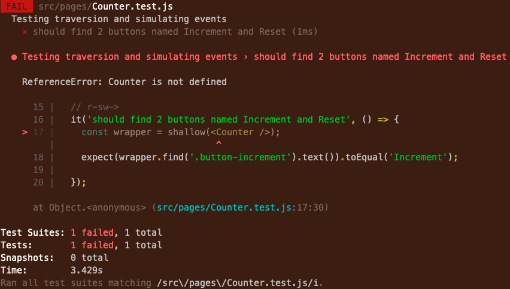
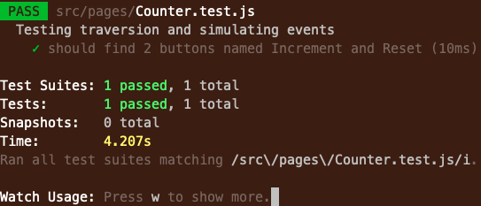
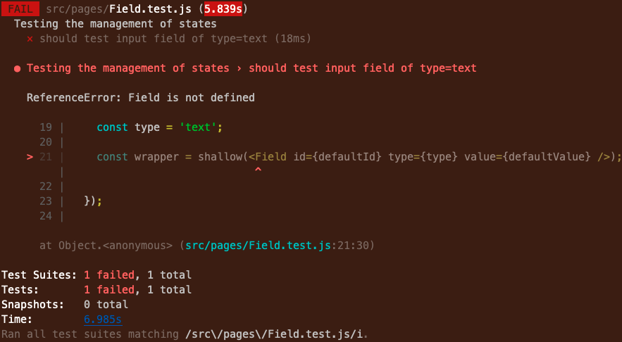

# Testing React

## Local Setup

In the project directory, you can run:

```bash
npm install # to install dependencies
```

```bash
npm run start # to run the app in development mode
```

```bash
npm run test # launches the test runner in interactive watch mode
```

If you are running into issues with `npm run test`, you can try:

1. Delete `node_modules` and `package-lock.json` folder.
1. Run `npm install` again.
1. Run `npm run test`.

If you are still running into errors, and it is related to `fsevents`, you can try:

1. On Mac, install `watchman` by running `brew install watchman`. [Link to issue and various solutions here](https://github.com/jest-community/vscode-jest/issues/423).
1. Try the previous steps above again.
1. If still getting errors, try installing `fsevents` by running `npm install fsevents`.

If you are still running into errors, let the instructor know so you can troubleshoot together.

## Goal


There are 2 main goals. First, we want to be able to test simple UI behaviours and user experience.  Functions supporting the UI will be in-directly tested through the UI itself.


## Jump to:

1. [Testing Pure React Components](#testing-pure-react-components)
    - [Before starting](#before-starting)
    - [Buttons](#buttons)
    - [State Management](#statment-management)
    - [Routing](#routing)
    - [Snapshots](#snapshots)


Note: The goal we want all engineers to realize when doing TDD is to learn how to test with existing code first.  Get good...get really good at testing with code that's already written before getting good at testing *before* the code is written.


## Testing Pure React Components

### Before start

Run the following command to launch the test runner on interactive mode:

```bash
npm run test
```


### Buttons

One of the key features of UI is providing user with an interactive experience.  Typically, `clicking`, on a page is a way for users to provide feedback and receive feedback from a web page.

Let's take a look at how to test a simple `clicking` action.  This will allow us to evaluate the following:
- did the click perform the intended action?
- is the button connected properly to the underlying react functions


Open up the `src/pages/Counter.js` React component.  Notice there are 2 buttons:
- the first button increments a counter to an `<h2>` tag
- the second button resets the counter back to 1

There are also 2 functions, using `state`, to perform the desired effect.


#### Find

1. Open up `src/pages/Counter.test.js` and create a new test case under `Problem 1)`.

    ```javascript
    it('should find 2 buttons named Increment and Reset', () => {

    });
    ```

1. Now we will use the `enzyme` function to render the React component and store that in memory:

    ```javascript
    it('should find 2 buttons named Increment and Reset', () => {
      const wrapper = shallow(<Counter />);

    });
    ```

    A couple of things to note:
    - we store a refrence of the rendered `Counter` component to a `wrapper`
    - `shallow` renders the Counter component at the parent layer only, eg. it will NOT *fully* render any components used by `Counter`
    - `Counter` is passed via standard React format as `<Counter />`

1. Next, let's verify 1 of the buttons exists in the component. We'll use the `find` function provided by the `wrapper` created on the previous line:

    ```javascript
    it('should find 2 buttons named Increment and Reset', () => {
      const wrapper = shallow(<Counter />);
      expect(wrapper.find('.button-increment').text()).toEqual('Increment');

    });
    ```

    Think of the `wrapper` as an `XML` source tree where the `find` function traverses it.  During the traversal, we search for the classname `button-increment` and grab its text.  The `expect` function is then used to verify the text obtained from the `find` matches what we are expecting, `Increment`.

1. After saving your file, your tests should execute automatically and yield the following message:

    [](images/counter-error.png)


    Your test does not have a reference the file it's testing against.  Import the file at the very top:

    ```javascript
    import Counter from './Counter';
    ```

1. Save your file again and the interactive test should now show a successful messsage:

    [](images/counter-pass.png)


1. Finally, add another expect to verify the `Reset` button exists with the proper text.

    ```javascript
    it('should find 2 buttons named Increment and Reset', () => {
      const wrapper = shallow(<Counter />);
      expect(wrapper.find('.button-increment').text()).toEqual('Increment');
      expect(wrapper.find('.button-reset').text()).toEqual('Reset');
    });
    ```


#### Clicking

Let's move onto something a bit more interesting by testing the behaviour of each button and verifying the expected effect.

1. In the `src/pages/Counter.test.js` test file, create another test case, under `Problem 2)`, and render the `Counter` component to a `wrapper`:

    ```javascript
    it('should update the counter after a single click', () => {
      const wrapper = shallow(<Counter />);

    });
    ```

1. The key here is to `click` on a button and see its effect in the component.  In order to click on the button, we need to find it first.  Once we find it, we can `simulate` a `click` on it.

    ```javascript
    it('should update the counter after a single click', () => {
      const wrapper = shallow(<Counter />);
      wrapper.find('.button-increment').simulate('click');

    });
    ```

1. To guarantee the `click` effect is updated in memory, we need to call an `update` on the `wrapper`:

    ```javascript
    it('should update the counter after a single click', () => {
      const wrapper = shallow(<Counter />);
      wrapper.find('.button-increment').simulate('click');
      wrapper.update();

    });
    ```

1. Finally, verify the counter between the `<h2>` tag has been incremented (remember the default value is `Current count: 1`):

    ```javascript
    it('should update the counter after a single click', () => {
      const wrapper = shallow(<Counter />);
      wrapper.find('.button-increment').simulate('click');
      wrapper.update();
      expect(wrapper.find('h2').text()).toEqual('Current count: 2');
    });
    ```

1. Your test result should now have 2 passed test cases.


1. At this point, it's not enough just to test the one `click` scenario.  For all we know, the following could be happening:
    - the initial value between the `<h2>` tag is 1
    - and the button `click` *multiplied* by `2`

    Or even worse:
    - the initial value between the `<h2>` tag is actually `2`
    - and the button `click` didn't affect anything

    Either of those unexpected scenarios would give us the same result.

1. To protect us from inadvertent changes to the code, we should add a couple of more checks in our test case, by first adding a check for the intial value:


    ```javascript
    it('should update the counter after a single click', () => {
      const wrapper = shallow(<Counter />);

      expect(wrapper.find('h2').text()).toEqual('Current count: 1');  // ensure the intial value is actually 1

      wrapper.find('.button-increment').simulate('click');
      wrapper.update();
      expect(wrapper.find('h2').text()).toEqual('Current count: 2');
    });
    ```

1. Save the file and you should still see it passing in your console.

1. Next, `simulate` clicking on the button a couple of times to ensure the values are being incremented:

    ```javascript
    it('should update the counter after a single click', () => {
      const wrapper = shallow(<Counter />);

      expect(wrapper.find('h2').text()).toEqual('Current count: 1');  // ensure the intial value is actually 1

      wrapper.find('.button-increment').simulate('click');
      wrapper.update();
      expect(wrapper.find('h2').text()).toEqual('Current count: 2');

      // click a couple of more times
      wrapper.find('.button-increment').simulate('click');
      wrapper.find('.button-increment').simulate('click');
      wrapper.find('.button-increment').simulate('click');
      wrapper.find('.button-increment').simulate('click');
      wrapper.update();
      expect(wrapper.find('h2').text()).toEqual('Current count: 6');
    });
    ```

1. Finally, while we're at it, test the `Reset` button to ensure it brings the value back to 1.

    ```javascript
    it('should update the counter after a single click', () => {
      const wrapper = shallow(<Counter />);

      expect(wrapper.find('h2').text()).toEqual('Current count: 1');  // ensure the intial value is actually 1

      wrapper.find('.button-increment').simulate('click');
      wrapper.update();
      expect(wrapper.find('h2').text()).toEqual('Current count: 2');

      // click a couple of more times
      wrapper.find('.button-increment').simulate('click');
      wrapper.find('.button-increment').simulate('click');
      wrapper.find('.button-increment').simulate('click');
      wrapper.find('.button-increment').simulate('click');
      wrapper.update();
      expect(wrapper.find('h2').text()).toEqual('Current count: 6');

      // testing the reset button
      wrapper.find('.button-reset').simulate('click');
      wrapper.update();
      expect(wrapper.find('h2').text()).toEqual('Current count: 1');
    });
    ```

    Note: as a side of caution, testing all scenarios was done for demonstration purposes, since the danger is that if of the `expect` fails, then the whole test case will fail.


### State Management

State management in React applications are fairly straight forward to manage.  The point of this UI testing is to ensure changes performed at the UI level has an effect in the component's state.

1. Open up `src/pages/Field.js` and closely inspect it.  You will notice an `input` field being tied directly to the component's state.  Therefore, any typing done on the `input` field will cause a change reaction, `onChange` --> `setState()`, which will update the `value` state.

1. Open up `src/pages/Field.test.js` and create a new test case:

    ```javascript
    it('should test input field of type=text', () => {

    });
    ```

1. Testing the `Field` component, will require three `props` to be passed in, so let's create some default ones:

    ```javascript
    it('should test input field of type=text', () => {
      const defaultValue = 'foo@bar.com';
      const defaultId = 'username';
      const type = 'text';

    });
    ```

1. Let's use the `shallow` function to render the `Field` component into memory (remember to pass in the default `props`):

    ```javascript
    it('should test input field of type=text', () => {
      const defaultValue = 'foo@bar.com';
      const defaultId = 'username';
      const type = 'text';

      const wrapper = shallow(<Field id={defaultId} type={type} value={defaultValue} />);

    });
    ```

1. Save the file and your tests should execute automatically and yield the following error:

    [](images/field-error.png)


    Your test does not have a reference to the `Field` component. Import the file at the very top:

    ```javascript
    import Field from './Field';
    ```

    After the `import`, all tests should now pass.

1. If we've learned anything in the past, let's verify the component's state has been updated with the `defaultValue`, which is `foo@bar.com`.

    ```javascript
    it('should test input field of type=text', () => {
      const defaultValue = 'foo@bar.com';
      const defaultId = 'username';
      const type = 'text';

      const wrapper = shallow(<Field id={defaultId} type={type} value={defaultValue} />);

      expect(wrapper.find('input').prop('value')).toEqual('foo@bar.com');


    });
    ```

    An important thing to note here is that we have no ability to directly check the state of React Hooks.  Instead we'll check the `value` property of our `input` component.

1. Let's create an `event` variable with a new `target` value we want to change to, in this case `bar@foo.com`.  We then `simulate` a change to the new `target` value by passing in its event:

    ```javascript
    it('should test input field of type=text', () => {
      const defaultValue = 'foo@bar.com';
      const defaultId = 'username';
      const type = 'text';

      const wrapper = shallow(<Field id={defaultId} type={type} value={defaultValue} />);

      expect(wrapper.find('input').prop('value')).toEqual('foo@bar.com');

      // simulate a change in the input field and verify state has been updated
      const event = { target: 'bar@foo.com' };
      wrapper.find('input').simulate('change', event);


    });
    ```

1. Finally, we update the wrapper to ensure everything is refreshed and check for the new value to be updated in our `input`:

    ```javascript
    it('should test input field of type=text', () => {
      const defaultValue = 'foo@bar.com';
      const defaultId = 'username';
      const type = 'text';

      const wrapper = shallow(<Field id={defaultId} type={type} value={defaultValue} />);

      expect(wrapper.find('input').prop('value')).toEqual('foo@bar.com');

      // simulate a change in the input field and verify state has been updated
      const event = { target: 'bar@foo.com' };
      wrapper.find('input').simulate('change', event);


      wrapper.update();
      expect(wrapper.find('input').prop('value')).toEqual('bar@foo.com');
    });
    ```


It's that easy!


### Routing

React applications are single page applications (SPA). `routes` are a mechanism used control the flow of a user experience eg. navigate through "pages".

In this example, we're going to test a simple route.

1. Open up the `src/pages/MemberPage.js` and notice how a `switch` is used to navigate to the `src/pages/LandingPage.js` and the `src/pages/NotFoundPage.js`.
    - if a `/` (also know as a root route) is provided, the `src/pages/LandingPage.js` is loaded
    - otherwise, the `src/pages/NotFoundPage.js` is loaded

1. Open up the `src/pages/MemberPage.test.js` and create a new test case:

    ```javascript
    it('valid path should redirect to landing page', () => {

    });
    ```

    In this scenario, we're going to test the root route.

1. We'll need to render the `MemberPage` into memory, but the problem is, there's no easy way to `simulate` a route change and have a page load up in memory.

    Instead we'll use a mechanism to call or inject a route against the `MemberPage.js`, then render it using `enzyme`.

    Let's encapsualte a `MemoryRouter` over the `MemberPage` and inject `/` into it.

    ```
    <MemoryRouter initialEntries={['/']}>
      <MemberPage />
    </MemoryRouter>
    ```

    Finally, we'll use the `enzyme` function, `mount`, to render the result into memory, which gives us the following:

    ```javascript
    it('valid path should redirect to landing page', () => {
      const wrapper = mount(
        <MemoryRouter initialEntries={['/']}>
          <MemberPage />
        </MemoryRouter>,
      );

    });
    ```

1. At this point, save your changes and fix any issues you see.

    Make sure you import all 3 pages at the top of `MemberPage.test.js`:

    ```javascript
    /* import all 3 pages here */
    import LandingPage from './LandingPage';
    import MemberPage from './MemberPage';
    import NotFoundPage from './NotFoundPage';
    ```

    Your test should now be ready to move on.

1. The `LandingPage` should already have been loaded into memory, so let's check that.

    ```javascript
    it('valid path should redirect to landing page', () => {
      const wrapper = mount(
        <MemoryRouter initialEntries={['/']}>
          <MemberPage />
        </MemoryRouter>,
      );

      expect(wrapper.find(LandingPage)).toHaveLength(1);

    });
    ```

    What's happening above is we're locating the whole 'LandingPage' inside the `wrapper`.

    Our expectation after using `find` is to ensure only one instance of the `LandingPage` exists, since it would be a bad user experience if it's being rendered more than once.

1. For completeness, we also want to make sure the `NotFoundPage` doesn't exist anywhere inside or alongside the `LandingPage':

    ```javascript
    it('valid path should redirect to landing page', () => {
      const wrapper = mount(
        <MemoryRouter initialEntries={['/']}>
          <MemberPage />
        </MemoryRouter>,
      );

      expect(wrapper.find(LandingPage)).toHaveLength(1);
      expect(wrapper.find(NotFoundPage)).toHaveLength(0);
    });
    ```


### Snapshots

As the name suggests, `jest` snapshot takes a *snapshot* of your component and uses it as the base for comparison. 

This comes in handy when you want to make sure our UI does not change unexpectedly.

A typical snapshot test case renders a UI component, takes a snapshot, then compares it to a reference snapshot file stored alongside the test. The test will fail if the two snapshots do not match: either the change is unexpected, or the referenced snapshot needs to be updated to the new version of the UI component.

**Note:** It is recommended that snapshots be checked in as part of the code commits!


1. Before we write a test case for `snapshots`, let's open up `src/components/DoctorDetails.js` and examine a very typical `React` component.  The `DoctorDetails` component takes a bunch of `props` and renders them with the appropriate labels.


1. Now open up `src/components/DoctorDetails.Snapshots.test.js` and let's focus on a very specific library, `react-test-renderer`.
    > This package provides a React renderer that can be used to render React components to pure JavaScript objects, without depending on the DOM or a native mobile environment.
    > Essentially, this package makes it easy to grab a snapshot of the platform view hierarchy (similar to a DOM tree) rendered by a React DOM or React Native component without using a browser or jsdom.

1. First, let's construct an *implementation* of `DoctorDetails`:

    ```javascript
    <DoctorDetails dob="1980-01-01" specialty="Cardiology" address={address} />
    ```

    Our simple `DoctorDetails` component accepts some standard properties.

1. Next, let's do an in-memory rendering of our `DoctorDetails` object using the `renderer` function.

    ```javascript
    const tree = renderer.create(
    <DoctorDetails dob="1980-01-01" specialty="Cardiology" address={address} />
    );
    ```

1. Finally, we'll make our comparison as follows:

    ```javascript
    expect(tree).toMatchSnapshot();
    ```

    That's it! You're definitely seeing some *magic* here as there's a lot going on behind the scenes.  The `toMatchSnapshot()` function is actually pretty flexible in the following ways:
    - it renders the `tree` object (which is a reference to the `DoctorDetails` component)
    - it will then try to locate an off-line version, previously saved copy, of `DoctorDetails`
    - if it cannot find the off-line copy, it will create a new folder called `__snapshots__` and place the current rendering inside of it.
    - if it can find the off-line copy, it will compare the two versions and tells us whether they match or not


1. In case you missed it, the whole test case has 2 lines:

    ```javascript
    const tree = renderer.create(
    <DoctorDetails dob="1980-01-01" specialty="Cardiology" address={address} />
    );
    expect(tree).toMatchSnapshot();
    ```


1. Now, since this will be the first time we're taking a snapshot of `DoctorDetails`, there will be no previous copy.  A new folder `__snapshots__` is created inside `src/components` with a file called `DoctorDetails.Snapshots.test.js.snap`. Open that file up and examine it.

    ```javascript
    // Jest Snapshot v1, https://goo.gl/fbAQLP

    exports[`display address info when there is one 1`] = `
    <div>
      <h5>
        Date of birth: 
        1980-01-01
      </h5>
      <h5>
        Specialty: 
        Cardiology
      </h5>
      <h5>
        Address: 
        123 Main Street
        
        Toronto
        , 
        Ontario
        
        A1A 1A1
      </h5>
    </div>
    `;
    ```
  
    Note: This file contains an exact DOM rendering of `DoctorDetails`, with all of the information passed to it.


1. To see the usefulness of `snapshots` in action, go back to the first line of your test case and change the `DOB` property from `1980-01-01` to `1981-01-01` and run your test case again:  

    ```javascript
    <DoctorDetails dob="1981-01-01" specialty="Cardiology" address={address} />
    ```

1. After the changing the data and running your test, you should get the following error:

    ```git
    - Snapshot
        + Received

        @@ -1,9 +1,9 @@
          <div>
            <h5>
              Date of birth: 
        -     1980-01-01
        +     1981-01-01
            </h5>
            <h5>
              Specialty: 
              Cardiology
            </h5>

          9 |     <DoctorDetails dob="1981-01-01" specialty="Cardiology" address={address} />
          10 |   );
        > 11 |   expect(tree).toMatchSnapshot();
            |                ^
          12 | 
          13 | });
          14 | 

          at Object.<anonymous> (src/components/DoctorDetails.Snapshots.test.js:11:16)

    › 1 snapshot failed.
    ```


That's it for snapshots!  You can see why they have their place in testing; especially for components where changes are minimal over its life-cycle.

If the component has indeed changed, then at least the test case gives you a warning and you have an option to address the uwanted change, update the snapshot...or delete the off-line copy and let `renderer` create a new snapshot for you.  It's pretty magical!


---
---

# Continued reading:


Mock Functions - [https://jestjs.io/docs/mock-function-api](https://jestjs.io/docs/mock-function-api)

Snapshots - [https://jestjs.io/docs/snapshot-testing](https://jestjs.io/docs/snapshot-testing)

Test Renderer - [https://reactjs.org/docs/test-renderer.html](https://reactjs.org/docs/test-renderer.html)

